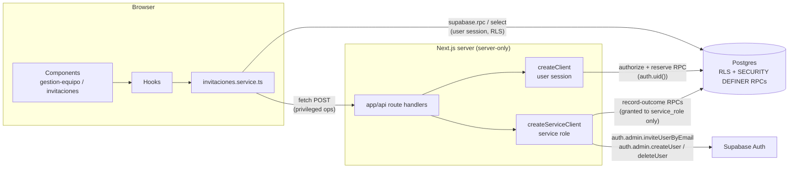
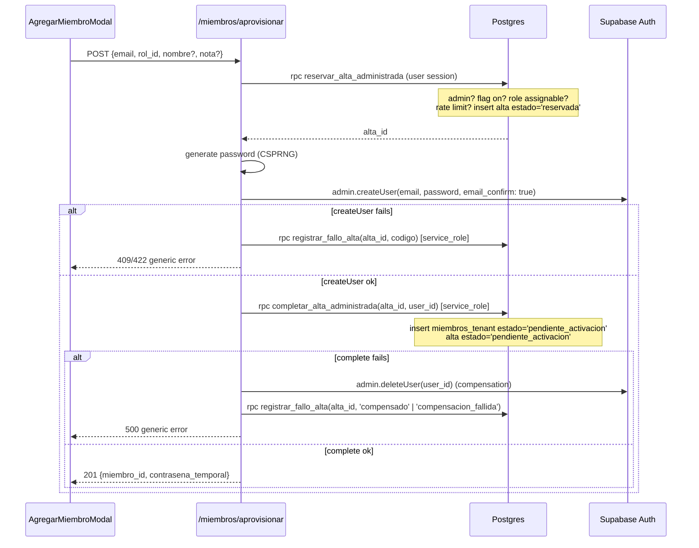
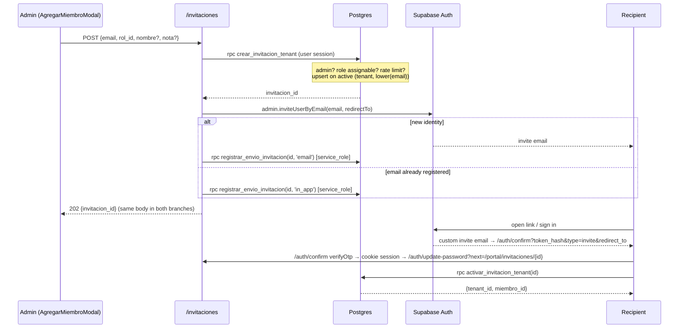

# Design: Admin Create and Invite Tenant Members

Motivation and scope: [proposal.md](./proposal.md). Source story: [US-0114](../../../projectspec/userstory/us0114-admin-create-and-invite-tenant-members.md).

## Context

### Current state relevant to this design

| Area | What exists today | Consequence for this change |
|---|---|---|
| Server delivery | Route handlers exist only at `src/app/auth/callback/route.ts` and `src/app/portal/bootstrap/route.ts`. There is no `src/app/api/`. | The privileged endpoints become the first `app/api` slice. |
| Service-role client | `createServiceClient()` in `src/services/supabase/server.ts` exists but is imported nowhere. | Reuse it and harden it; do not add a second admin client. |
| Tenant access | `tenantService.canUserAccessTenant` (`tenant.service.ts:275`) grants access when **any** `miembros_tenant` row exists and never reads `estado`. `getCachedTenantAccess` wraps it for layouts. | A `pendiente_activacion` row would currently grant full portal access. |
| RLS helpers | Policies scope through `get_admin_tenants_for_authenticated_user()`, `get_member_tenants_for_authenticated_user()`, and `get_trainer_or_admin_tenants_for_authenticated_user()`. | These three helpers are the main place to deny `pendiente_activacion`, but policies that join `miembros_tenant` directly need checking too. |
| Membership estado | `miembros_tenant_estado_ck` allows `activo`, `mora`, `suspendido`, `inactivo`. `miembros_tenant_novedades.tipo` has its own check. | Both constraints change. |
| Email delivery | Supabase Auth sends mail through a custom SMTP provider (Resend), already configured. | Invitation emails use the same channel and do not depend on Supabase's low default SMTP quota. |
| Password flows | `/auth/update-password` and `authService.updatePassword` (`auth.ts:70`) exist. `/auth/callback` exchanges the code and forwards `next`, routing `/portal*` through `/portal/bootstrap`. | Invitation onboarding and forced password change reuse these instead of adding new auth pages. |
| Team UI | `EquipoPage` has an `equipo \| solicitudes \| bloqueados` tab bar, and the Solicitudes slice (`SolicitudesTab` → `SolicitudesTable` → `SolicitudEstadoBadge`, `useSolicitudesAdmin`, `solicitudes.service.ts`) is a complete admin list-with-actions pattern. | The Invitaciones slice copies this shape one-for-one. |

### Constraints

- Feature-slice layout and layer rules from `projectspec/03-project-structure.md`: **page → component → hook → service → types**, with no Supabase calls from components.
- Auth identity creation (Supabase Auth API) and membership insertion (Postgres) cannot share a transaction.
- Migrations are applied to the **local** Supabase stack only and are never pushed to the remote project as part of this change.
- **UI follows the current `gestion-equipo` patterns.** Unifying it with the `entrenamientos-publicos` look is a separate, later effort.

## Goals / Non-Goals

**Goals:**

- One server-only boundary for the two operations that need the service role: sending an Auth invitation and creating an Auth user. Everything else goes through `SECURITY DEFINER` RPCs that do their own authorization, following the `cambiar_estado_miembro` pattern already in the codebase.
- Deny `pendiente_activacion` at the database layer (RLS helpers) and at the app layer (`canUserAccessTenant`), so neither the UI nor a direct browser query can use a pending membership.
- Keep the managed mode off everywhere by default, controlled only by the platform owner through `admin_tenants`.
- Reuse the existing admin tab, table, modal, and badge components and styles so the new screens look like the rest of `gestion-equipo`.

**Non-Goals:**

- Visual alignment with `entrenamientos-publicos` (`landing-*` tokens, drawers). Deferred to a design-unification change.
- Sending mail outside Supabase Auth or restyling other Auth emails. Only the Invite template's link changes (see D4), and existing accounts get an **in-app** invitation rather than an email.
- A platform-owner console or role.
- IP-based rate limiting in v1 (see D9).
- Bulk/CSV onboarding and the other non-goals already listed in the proposal.

## Architecture

**Rule:** a route handler exists only when an operation needs `auth.admin.*`. Cancel, list, accept, and activate need nothing beyond the caller's own session, so they are RPCs called from the service layer, the same way `cambiar_estado_miembro` is called today.

| Operation | Channel | Why |
|---|---|---|
| Create invitation | `POST /api/portal/orgs/[tenant_id]/invitaciones` | Sends the Auth invite email (service role) |
| Resend invitation | `POST /api/portal/orgs/[tenant_id]/invitaciones/[invitacion_id]/reenviar` | Sends the Auth invite email (service role) |
| Provision account | `POST /api/portal/orgs/[tenant_id]/miembros/aprovisionar` | `auth.admin.createUser` (service role) |
| Cancel invitation | RPC `cancelar_invitacion_tenant` | Admin authorization inside the RPC |
| List invitations (admin) | `select` on `invitaciones_tenant` under RLS | Admin SELECT policy |
| List / read my invitations | RPC `get_mis_invitaciones_pendientes`, `get_invitacion_para_aceptar` | Matches the caller's verified email without exposing the table |
| Accept invitation | RPC `activar_invitacion_tenant` | Caller's identity is the proof |
| Activate provisioned account | RPC `activar_alta_administrada` | Caller's identity is the proof |
| Admin activates a pending member | Existing RPC `cambiar_estado_miembro` | Decision from the proposal |

## Decisions

### D1. `admin_tenants` is a 1:1 entitlement table, writable only by privileged access

`admin_tenants(tenant_id uuid primary key references tenants on delete cascade, aprovisionamiento_administrado_habilitado boolean not null default false, created_at, updated_at)`.

- **Row existence:** the migration backfills one row per existing tenant, and an `after insert on tenants` trigger (`ensure_admin_tenant_row`) creates the row for each new tenant. Because no application code creates tenants today, the trigger is the only safe place to do this.
- **RLS:** a single SELECT policy, `tenant_id in (select id from get_admin_tenants_for_authenticated_user())`, lets a tenant administrator see their own entitlements. There are no INSERT/UPDATE/DELETE policies, so the platform owner writes through the service role or the SQL console.
- **Authoritative check:** the server never trusts the UI's copy of the flag. `reservar_alta_administrada` re-reads it inside the transaction.
- **Name:** kept as `admin_tenants`, as requested. Existing policies use `admin_tenants` as a subquery alias. Inside those subqueries the alias shadows the table, so nothing breaks, but new SQL in this change should always write `public.admin_tenants` and use a different alias such as `at` to stay readable.

*Alternatives:* a column on `tenants` was rejected because tenant admins can already update `tenants` through `updateTenant`, so they could enable the mode for themselves. A generic key/value `tenant_features` table was rejected because typed columns keep the check constraints and defaults explicit.

### D2. `pendiente_activacion` is denied in the three RLS helpers and in `canUserAccessTenant`

- **Database:** redefine `get_admin_tenants_for_authenticated_user`, `get_member_tenants_for_authenticated_user`, and `get_trainer_or_admin_tenants_for_authenticated_user` to add `and mt.estado <> 'pendiente_activacion'`. Most tenant-capability policies go through these three functions, so this one edit covers most of the RLS surface.
- **Direct joins:** a migration-time audit lists every policy, view, and function whose definition mentions `miembros_tenant` (query `pg_policies`, `pg_views`, `pg_proc.prosrc`). Each one either goes through a helper or gets the same predicate. The audit results are recorded in `tasks.md`.
- **App layer:** `canUserAccessTenant` selects `estado` and returns `allowed: false` with a new field `pendingActivation: true` when the membership is pending. `TenantLayout` already redirects when `allowed` is false. The redirect target becomes `/portal/activar-cuenta/[tenant_id]` when `pendingActivation` is set, otherwise the existing `/portal/orgs`.
- **Views:** `v_miembros_equipo` keeps returning pending rows, because the admin must see them. It relies on base-table RLS, and the admin reading it is not pending.

*Alternative:* checking only in `canUserAccessTenant` and the layouts was rejected. The browser holds a Supabase session and could query tenant tables directly.

### D3. Provisioning is a reserve → create → complete saga with compensation

- `altas_administradas_tenant.estado` takes the values `reservada`, `pendiente_activacion`, `activada`, `fallida`. It also stores `codigo_error` (a short allow-listed code, never a raw Auth error), `metodo = 'contrasena_temporal'`, `usuario_id` (nullable until created), `creada_por`, `activated_at`, and timestamps. It never stores the password.
- **Grants:** `completar_alta_administrada` and `registrar_fallo_alta` are `revoke execute ... from public, authenticated` and `grant execute ... to service_role`. A browser session cannot call them.
- **Retry:** a row left in `reservada` (the process died between steps) or in `fallida` with `codigo_error = 'compensacion_fallida'` shows up for operational review. This change does not add automatic retry; the admin just submits again, and the partial unique index on active states (see D5) lets them.
- **Existing Auth user:** this mode cannot return a password for an account it did not create, so the response is necessarily different. The route returns `409` with the message *"No es posible crear una cuenta con este correo. Usa la invitación por email."* This reveals that the email exists, but only to an administrator of a tenant the platform owner has entitled, and every attempt is rate-limited and audited. This is recorded as an accepted risk.
- **Name:** `nombre` (optional) is passed as `user_metadata` to `createUser`, which the existing new-user provisioning trigger already maps into `usuarios`. The trigger also creates the default `public` tenant membership, as it does for every new user.
- **Password generation:** `src/lib/portal/password-generator.ts` starts with `import 'server-only'` and uses `crypto.randomInt` to build a 16-character password with at least one character from each class. The password exists only in the route's local scope and in the single response body, with `Cache-Control: no-store`.

### D4. Invitations: Auth email for new identities, in-app inbox for existing ones

- **Invite link (changed during implementation):** admin-initiated invites carry no PKCE verifier, so Supabase's default link returns the session in the URL fragment (`#access_token=…`), which the server route `/auth/callback` cannot read. The Invite email template is therefore customized (`supabase/templates/invite.html`, enabled in `supabase/config.toml`, and the same template must be set in the production dashboard) to link to `{{ .SiteURL }}/auth/confirm?token_hash={{ .TokenHash }}&type=invite&redirect_to={{ .RedirectTo }}`. The new server route `/auth/confirm` calls `verifyOtp`, sets the cookie session, accepts `redirect_to` only when same-origin or equal to `APP_URL`'s origin, and redirects to `/auth/update-password?next=<path>`. No tokens appear in URLs or browser history.
- **`redirectTo`:** `${APP_URL}/portal/invitaciones/${id}`. `APP_URL` is a server env var and is never derived from request headers, which an attacker could spoof to point the email link at another domain. Values: `http://localhost:3000` locally and `https://www.grit-arena.com` in production. Both origins must be on the Supabase Auth redirect allow-list (`http://localhost:3000/**`, `https://www.grit-arena.com/**`).
- **`/auth/update-password`** gains support for a safe `next` parameter, validated the same way `resolveOrigin` does it (must start with `/`, must not start with `//`). It currently ignores `next`.
- **Existing accounts:** Supabase's `inviteUserByEmail` fails for an email that is already registered, and sending another kind of mail is out of scope. The invitation is still created, and the recipient finds it in an **"Invitaciones pendientes"** section of `/portal/orgs` (`PortalTenantsPage`) the next time they sign in. This also meets the story's rule that an existing account is never attached automatically.
- **No enumeration through the API:** both branches return the same `202` body. The delivery channel is stored in `canal_entrega` (`email` \| `in_app`), which admin RLS does not expose: the admin list reads a view `v_invitaciones_tenant_admin` that leaves that column out, and the UI shows `pendiente` and `enviada` with one label, *"Pendiente"*.
- **Activation RPC:** `activar_invitacion_tenant(p_invitacion_id)` works exactly as the story describes (`FOR UPDATE`, state and expiry checks, verified-email match through `auth.users.email_confirmed_at is not null` and `lower(email)`, insert with `ON CONFLICT (tenant_id, usuario_id) DO NOTHING`, set `aceptada`). If the caller already has a membership in the tenant, the RPC marks the invitation `aceptada` and returns the existing `miembro_id` **without changing the role**. Invitations never escalate an existing member's role.
- **Resend:** only for `pendiente`, `enviada`, and `expirada`. It sets `expires_at = now() + interval '7 days'`, moves `expirada` back to `pendiente`, and repeats the Auth invite (again returning the same response whichever branch runs). It is rate-limited per invitation (D9).
- **Cancel:** `cancelar_invitacion_tenant` sets `cancelada` and `cancelled_at`. It is allowed from `pendiente`, `enviada`, and `expirada`, and it is idempotent on `cancelada`.

### D5. Data model details

- **`invitaciones_tenant`:**
  - **Columns:** as listed in the story, plus `nombre text null`, `nota_admin text null check (char_length <= 500)`, `canal_entrega text null check in ('email','in_app')`, and `codigo_error text null`.
  - **Email:** stored as `text`, with the unique index on `lower(email)`. `citext` is not used, to avoid adding an extension.
  - **Uniqueness:** `create unique index ... on invitaciones_tenant (tenant_id, lower(email)) where estado in ('pendiente','enviada')`.
  - **Admin list:** `(tenant_id, estado, created_at desc)`.
  - **Recipient lookup:** `(lower(email), estado)`, because recipients are matched by email.
  - **Activation lookup:** `(auth_user_id, estado)`.
- **`altas_administradas_tenant`:** partial unique `(tenant_id, lower(email)) where estado in ('reservada','pendiente_activacion')`. The table stores `email` so the reservation step can be deduplicated before an Auth user exists.
- **RLS for both tables:** admin SELECT through `get_admin_tenants_for_authenticated_user()`. There are no direct INSERT/UPDATE/DELETE policies; every write goes through RPCs.
- **`miembros_tenant.estado`:** the check constraint becomes `('activo','mora','suspendido','inactivo','pendiente_activacion')`.
- **`miembros_tenant_novedades.tipo`:** the check gains `activacion_cuenta`, so the audit log can tell account activation apart from `reactivacion` after a suspension.
- **Assignable roles:** `administrador`, `entrenador`, `usuario`, checked through `roles.nombre` inside the RPCs. An admin can assign `administrador`. That matches what `AceptarSolicitudModal` allows today, and the story's "final admin review for privileged roles" stays optional and is not part of this change.

### D6. Leaving `pendiente_activacion`

| Path | Actor | Transition | Novedad tipo |
|---|---|---|---|
| `activar_alta_administrada(p_tenant_id)` | The provisioned user, after `updatePassword` succeeds | → `activo`, alta → `activada` | `activacion_cuenta` (`registrado_por` = the user) |
| `cambiar_estado_miembro` | Tenant admin | → `activo` or `inactivo` | `activacion_cuenta` or `otro` |

- `cambiar_estado_miembro` rejects `p_nuevo_estado = 'pendiente_activacion'` with `SQLSTATE 22023`. No path leads back **into** the pending state.
- From `pendiente_activacion`, the only allowed targets are `activo` and `inactivo`. Any other target raises `22023`.
- The admin path also sets the linked `altas_administradas_tenant` row to `activada`, so the two tables never disagree.
- **Pending accounts never expire** (decided). A `pendiente_activacion` membership stays pending until the member activates it or an admin moves it to `activo` or `inactivo`. The pg_cron job only expires invitations, not provisioned accounts.
- **Admin-managed athletes who never sign in** (decided: no separate mode). For athletes who do not want to use the app, the admin provisions the account with a temporary password, does not deliver it, and activates the member from `gestion-equipo`. The member then behaves like any `activo` member the admin manages.

### D7. Recipient-side routes

| Route | Purpose | Component |
|---|---|---|
| `/portal/orgs` (existing) | Adds an "Invitaciones pendientes" section above the org grid, listing the caller's invitations with tenant name, role, expiry, and an *Aceptar* button | `PortalTenantsPage` + new `InvitacionesPendientesSection` |
| `/portal/invitaciones/[invitacion_id]` | Landing page after the email link or the *Aceptar* button: shows tenant, role, and expiry, then *Aceptar invitación*, and on success routes to `/portal/orgs/[tenant_id]` | `AceptarInvitacionPage` |
| `/portal/activar-cuenta/[tenant_id]` | Forced password change for a provisioned account: new password and confirmation, then `updatePassword`, then `activar_alta_administrada`, then routes into the tenant | `ActivarCuentaPage` |

These pages sit **outside** `orgs/[tenant_id]`, so `TenantLayout` does not block them. Each one handles invalid, expired, cancelled, and email-mismatch cases with explicit messages instead of a generic 404.

### D8. UI design — current `gestion-equipo` patterns

No new visual language. Every new component copies the classes and structure of its closest existing counterpart:

| New component | Mirrors | Key details |
|---|---|---|
| `EquipoPage` changes | Its own tab bar and the "Configurar Suspensión" action row | New `invitaciones` tab button with the same classes, plus a turquoise count badge for active invitations (as on Solicitudes). An **"Agregar miembro"** button (`person_add` icon, same turquoise primary style) sits to the left of "Configurar Suspensión" in the existing `flex justify-end` row and is also shown at the top of the Invitaciones tab. |
| `AgregarMiembroModal` | `AceptarSolicitudModal` / `CambiarEstadoModal` | `fixed inset-0 z-50 bg-black/60` backdrop; `max-w-md rounded-lg border-portal-border bg-navy-medium p-6` card; uppercase `text-xs tracking-wider text-slate-400` labels; `bg-navy-deep` inputs. **Fields:** Correo (required), Rol (required; options from `useEquipo().roles`, so the component makes no Supabase call, unlike `AceptarSolicitudModal`), Nombre (optional), Nota (optional textarea, 500 max). A **Modo** pair of radio cards appears only when `aprovisionamiento_administrado_habilitado`: "Invitación por email" (default) and "Cuenta con contraseña temporal". Selecting the second shows an amber notice box (`border-amber-400/30 bg-amber-900/20 text-amber-200`) explaining the security impact. There is a warning line when the email already matches an active member in `useEquipo().members`, checked on the client against data the admin can already see. It has an inline error and a loading state like `CambiarEstadoModal`, with *Cancelar* / *Confirmar* buttons. |
| `ContrasenaTemporalModal` | Same modal shell | Shows the member email and the password in a `font-mono bg-navy-deep` box with a *Copiar* button. There is a required checkbox, *"Compartiré esta contraseña por un canal aprobado"*. *Cerrar* stays disabled until it is checked. Backdrop click and Escape are ignored before acknowledgement. The password lives only in the modal's props and is dropped from parent state on close. |
| `InvitacionesTab` | `SolicitudesTab` | Same `glass` loading, error-with-*Reintentar*, and empty states ("No hay invitaciones."). An estado `<select>` styled like `EquipoHeaderFilters` defaults to active (`pendiente` + `enviada`). |
| `InvitacionesTable` | `SolicitudesTable` | **Columns:** Correo · Rol · Estado · Expira · Creada · Acciones. **Actions:** *Reenviar* (`border-portal-border` neutral) and *Cancelar* (rose, with inline confirm like *Rechazar*). Actions hide for terminal states. |
| `InvitacionEstadoBadge` | `SolicitudEstadoBadge` | `pendiente`/`enviada` → amber "Pendiente"; `aceptada` → emerald; `expirada` → orange; `cancelada` → slate; `fallida` → rose. |
| `EquipoStatusBadge` | Itself | Adds `pendiente_activacion` → sky (`bg-sky-900/30 text-sky-300 border-sky-400/30`), "Pendiente de activación". |
| `EquipoHeaderFilters` | Itself | Adds the new estado option. |
| `CambiarEstadoModal` | Itself | When `member.estado === 'pendiente_activacion'`, limits estado options to Activo/Inactivo and adds the tipo option "Activación de cuenta". |
| Recipient pages (D7) | Portal page shell (`section space-y-6`, `text-3xl font-semibold text-slate-100` header, `glass` cards) | Centered card with a large material-symbol status icon for the success, expired, and mismatch states. |

### D9. Rate limits live in the reserving RPCs

There is no rate-limit infrastructure (no Redis or edge middleware), so the limits are counted in Postgres inside the transaction that reserves the operation, using the audit tables themselves:

| Limit | Default | Checked in |
|---|---|---|
| Invitations created per admin per hour | 30 | `crear_invitacion_tenant` |
| Invitations created per tenant per day | 200 | `crear_invitacion_tenant` |
| Resends per invitation per hour | 3 | `reenviar_invitacion_tenant` (reserve step of the resend route) |
| Temporary-password accounts per tenant per day | 20 | `reservar_alta_administrada` |

- When a limit is hit, the RPC raises `SQLSTATE P0001` with message `RATE_LIMIT` and the route returns `429`.
- The defaults are constants in the migration. They can move into `admin_tenants` columns later, without changing the API.
- **No IP-based limiting in v1** (decided). Tenants are created only by the platform owner, so an attacker cannot multiply admin accounts to bypass the per-admin and per-tenant limits. If needed later, it belongs at the hosting edge (firewall/WAF), not in Postgres, which never sees the client IP.

### D10. Service-role hygiene and audit logging

- **Hardened client:** `server.ts` gets `import 'server-only'`. `createServiceClient()` throws at call time when `SUPABASE_SERVICE_ROLE_KEY` is missing, and it passes `auth: { persistSession: false, autoRefreshToken: false }`.
- **Env docs:** `.env.example` documents `SUPABASE_SERVICE_ROLE_KEY` and `APP_URL` under a "server-only, never NEXT_PUBLIC_" comment.
- **Bundle check:** a static check in `tasks.md` greps the source tree to confirm `SUPABASE_SERVICE_ROLE_KEY` and `@/services/supabase/server` appear only in server modules, never in `'use client'` files, `src/components`, or `src/hooks`. The project does not run `next build` as part of verification.
- **Audit logging:** a small `src/lib/portal/audit-log.ts` (`server-only`) writes one JSON line per event through `console.info`, using an explicit allow-list of fields (`evento`, `tenant_id`, `actor_id`, `objetivo_id`, `resultado`, `codigo`). Passwords, tokens, emails, and raw error objects can never be passed. The DB tables remain the durable audit trail; the log line is for alerting.

### D11. Admin athlete pickers exclude pending members

A pending member must be activated before an admin can operate on their behalf. The two pickers that let an admin act for another athlete currently exclude only `inactivo`:

| Picker | Current filter | Change |
|---|---|---|
| Booking for another athlete — `ReservaFormModal.tsx:131` (`miembros_tenant`) | `.neq('estado', 'inactivo')` | `.not('estado', 'in', '(inactivo,pendiente_activacion)')` |
| Subscription for another athlete — `useCrearSuscripcion.ts:166` (`v_miembros_equipo`) | `.neq('estado', 'inactivo')` | `.not('estado', 'in', '(inactivo,pendiente_activacion)')` |

- **Scope is the pickers only.** The `reservas`/`suscripciones` insert policies and `book_and_deduct_service_units` do not check the target athlete's membership estado today, and this change does not add that check. An admin is trusted within their own tenant, so a UI-level exclusion is enough for this use case.
- **Why not reuse the existing restriction:** the `usuario_estado = 'activo'` booking restriction already rejects pending members, but only on trainings that have that restriction, and it does nothing for subscriptions.
- **Existing layering issue left alone:** `ReservaFormModal` queries Supabase directly from a component, which breaks the project's layer rules. Moving it into a hook/service is out of scope; only the filter changes.

### D12. Feature-slice file map (page → component → hook → service → types)

| Layer | Path |
|---|---|
| Migration | `supabase/migrations/<ts>_admin_tenants_entitlements.sql` |
| Migration | `supabase/migrations/<ts>_miembros_pendiente_activacion.sql` (estado + novedad tipo checks, RLS helpers, `canUser…`-related view changes, `cambiar_estado_miembro` rules) |
| Migration | `supabase/migrations/<ts>_invitaciones_y_altas_administradas.sql` (tables, indexes, RLS, RPCs, admin view, pg_cron expiry job) |
| API | `src/app/api/portal/orgs/[tenant_id]/invitaciones/route.ts` |
| API | `src/app/api/portal/orgs/[tenant_id]/invitaciones/[invitacion_id]/reenviar/route.ts` |
| API | `src/app/api/portal/orgs/[tenant_id]/miembros/aprovisionar/route.ts` |
| Page | `src/app/portal/invitaciones/[invitacion_id]/page.tsx` |
| Page | `src/app/portal/activar-cuenta/[tenant_id]/page.tsx` |
| Page (mod) | `src/app/auth/update-password/page.tsx` (safe `next`) |
| Page (mod) | `src/app/portal/orgs/[tenant_id]/layout.tsx` (`TenantLayout` redirect on `pendingActivation`) |
| Component | `src/components/portal/gestion-equipo/gestion-invitaciones/{AgregarMiembroModal,ContrasenaTemporalModal,InvitacionesTab,InvitacionesTable,InvitacionEstadoBadge}.tsx` |
| Component | `src/components/portal/invitaciones/{AceptarInvitacionPage,ActivarCuentaPage,InvitacionesPendientesSection}.tsx` |
| Component (mod) | `EquipoPage`, `EquipoStatusBadge`, `EquipoHeaderFilters`, `CambiarEstadoModal`, `PortalTenantsPage`, `entrenamientos/reservas/ReservaFormModal` (picker filter, D11) |
| Hook (mod) | `gestion-suscripciones/useCrearSuscripcion.ts` (picker filter, D11) |
| Hook | `src/hooks/portal/gestion-invitaciones/{useInvitacionesAdmin,useAgregarMiembro,useTenantEntitlements}.ts` |
| Hook | `src/hooks/portal/invitaciones/{useMisInvitaciones,useAceptarInvitacion,useActivarCuenta}.ts` |
| Service | `src/services/supabase/portal/invitaciones.service.ts` (RPCs, selects, and `fetch` to the API routes) |
| Service (mod) | `tenant.service.ts` (`canUserAccessTenant` estado + `getTenantEntitlements`), `equipo.service.ts` (new estado/tipo mapping) |
| Types | `src/types/portal/invitaciones.types.ts` (`InvitacionEstado`, `InvitacionRow`, `AltaAdministradaResultado`, `InvitacionesServiceError` with codes `forbidden`, `unauthenticated`, `invalid_request`, `rate_limited`, `not_found`, `expired`, `cancelled`, `already_accepted`, `email_mismatch`, `feature_disabled`, `account_exists`, `unexpected`) |
| Types (mod) | `equipo.types.ts` (`MiembroEstado`, `MiembroNovedadTipo`), `tenant.types.ts` (`AdminTenantEntitlements`, `TenantAccessDecision.pendingActivation`) |
| Lib | `src/lib/portal/password-generator.ts`, `src/lib/portal/audit-log.ts` (both `server-only`) |

## Risks / Trade-offs

- **[A policy joins `miembros_tenant` directly and misses the new predicate]** → Run the D2 catalog audit as a migration-time query with its results recorded in `tasks.md`, and add a regression test that signs in as a `pendiente_activacion` user and asserts empty results or denial on every tenant-scoped table.
- **[`canal_entrega` or badge wording still leaks whether an email exists]** → Keep one API response body and one badge label for `pendiente` and `enviada`, and exclude `canal_entrega` from the admin view. An admin can still guess when an invitee who is already a member accepts instantly; accepted as low impact.
- **[Temporary-password mode reveals account existence (`409`)]** → Accepted. The mode is limited to entitled tenants and rate-limited, every attempt is audited, and the message points to the invitation mode.
- **[Existing accounts receive no email]** → The in-app section on `/portal/orgs` is the delivery channel. The admin sees the invitation as "Pendiente" either way. Revisit if custom email is added later.
- **[Compensating `deleteUser` fails, leaving an orphan Auth user]** → The alta is left `fallida` with `codigo_error = 'compensacion_fallida'` and an audit log line is written at error level. The orphan has no tenant membership apart from the default `public` one, so it has no tenant capabilities. The platform owner resolves it manually.
- **[The client skips `updatePassword` and calls `activar_alta_administrada` directly]** → Documented limitation from the story: the gate controls business access and does not prove the password changed. The RPC requires the caller to own the pending alta, and the admin-side activation path exists for tenants that need external confirmation.
- **[An admin who activates an account without delivering the temporary password knows a valid password for an active account]** → Accepted as part of the chosen approach for admin-managed athletes. The password is shown only once and never stored, every provisioning and activation is audited, and the athlete can take control of the account at any time with "¿Olvidaste tu contraseña?".
- **[Pending members are excluded only in the pickers, not in insert policies or the booking RPC]** → Accepted. Admins are trusted within their own tenant, and the pending member's own session is blocked by RLS (D2).
- **[Rate-limit counting in Postgres adds a query per write]** → Writes are low-volume and the queries are bounded by the new `(tenant_id, …, created_at)` indexes.
- **[`admin_tenants` name collides with an existing SQL alias]** → New SQL always writes `public.admin_tenants` with a different alias. Nothing existing changes.
- **[Visual inconsistency with `entrenamientos-publicos`]** → Intentional; a later unification change will address it.

## Migration Plan

1. **Apply locally only.** Run `supabase migration up` (or `supabase db reset`) against the local stack. **Do not** run `supabase db push` or link and push to the remote project as part of this change.
2. **Order:**
   1. `admin_tenants_entitlements` (table, backfill, trigger, RLS)
   2. `miembros_pendiente_activacion` (checks, helper redefinitions, `cambiar_estado_miembro` rules)
   3. `invitaciones_y_altas_administradas`

   Each migration is idempotent (`if not exists`, `create or replace`, `drop constraint if exists` before re-adding).
3. **Deploy app code** with `SUPABASE_SERVICE_ROLE_KEY` (the project's service-role key, not a personal access token) and `APP_URL=https://www.grit-arena.com` set as server env vars, with `https://www.grit-arena.com/**` on the Supabase Auth redirect allow-list, with the production Invite email template replaced by the contents of `supabase/templates/invite.html`, and with the project's Auth Site URL equal to `APP_URL` (the template builds the link from `{{ .SiteURL }}`; a different host would drop the session cookie between `/auth/confirm` and `/portal/bootstrap`). Locally, `supabase/config.toml` `site_url` is `http://localhost:3000` for the same reason.
4. **Rollout:** all tenants start with `aprovisionamiento_administrado_habilitado = false`. The invitation mode is available to every tenant admin immediately. The platform owner enables managed provisioning per vetted tenant.
5. **Rollback:**
   - **App:** revert the deploy. No existing flow depends on the new routes.
   - **DB:** first set every `pendiente_activacion` membership to `inactivo`, then restore the old check constraints and helper definitions. The new tables can stay in place (harmless) or be dropped once no longer referenced.

## Open Questions

- **Preview deployments.** `APP_URL` is settled for local (`http://localhost:3000`) and production (`https://www.grit-arena.com`). Assumed: invitations are **not** supported on preview deployments, so no wildcard allow-list entry is added. Revisit if QA needs to test invitations on previews.
