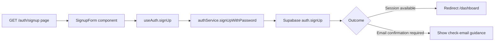

## Context

The application already ships a redesigned login experience (`/auth/login`) with a split-screen layout and Supabase-backed authentication flow. Signup support exists in the auth hook/service layer (`useAuth().signUp` and `authService.signUpWithPassword`) but there is no dedicated `/auth/signup` page in `src/app/auth/` and no signup UI component in `src/components/auth/`.

Constraints from project architecture (`projectspec/03-project-structure.md`) require preserving separation of concerns and implementing changes through the page → component → hook → service → types flow. The implementation must keep the left panel unchanged and only redesign the signup panel.

## Goals / Non-Goals

**Goals:**
- Add a production-ready `/auth/signup` route using the existing split layout pattern.
- Reuse `LoginBenefitsPanel` without content/style modifications.
- Implement right-side signup form UI and validation for required fields.
- Integrate submit flow via `useAuth().signUp` and existing Supabase service.
- Handle both signup success outcomes: confirmation-required and immediate-session.
- Keep login/signup cross-navigation and document route behavior.

**Non-Goals:**
- No redesign of login left panel or other auth screens.
- No social auth/OAuth provider additions.
- No password reset or onboarding workflow implementation.
- No middleware policy or backend endpoint redesign.

## Decisions

1. **Route composition mirrors login page structure**
   - Decision: Implement `src/app/auth/signup/page.tsx` with the same split layout composition used by `/auth/login`.
   - Why: Consistent UX and minimal architectural risk.
   - Alternatives considered:
     - Single-column signup-only view: rejected for design inconsistency.
     - Shared auth route with mode toggle: rejected to keep route semantics explicit and simpler to maintain.

2. **Reuse existing left panel component as-is**
   - Decision: Mount `LoginBenefitsPanel` directly on `/auth/signup`.
   - Why: Requirement explicitly demands unchanged left panel and avoids duplicate markup/styles.
   - Alternatives considered:
     - Duplicating panel markup in signup component: rejected due to drift risk.

3. **Create dedicated `SignupForm` component for right panel**
   - Decision: Add `src/components/auth/SignupForm.tsx` as a client component.
   - Why: Keeps route composition clean and encapsulates form state, validation, and feedback.
   - Alternatives considered:
     - Extending `LoginForm` into multi-mode component: rejected to avoid conditional complexity and regression risk.

4. **Validation in component before service call**
   - Decision: Enforce required fields and password confirmation match in `SignupForm`.
   - Why: Immediate UX feedback and fewer unnecessary service calls.
   - Alternatives considered:
     - Service-only validation feedback: rejected for slower, less clear UX.

5. **Preserve existing auth contracts**
   - Decision: Use `useAuth().signUp` without contract changes unless implementation blockers are found.
   - Why: Existing hook/service contract already aligns with required behavior.

## Risks / Trade-offs

- **[Design source ambiguity]** `projectspec/designs/signup.html` may be incomplete in repository state → **Mitigation:** Implement with currently approved user story constraints and treat visual deltas as follow-up adjustments.
- **[Behavior variance by Supabase config]** Email confirmation behavior differs by project settings → **Mitigation:** Handle both outcomes explicitly (session vs confirmation message).
- **[Form complexity drift]** Adding extra fields beyond required scope can slow delivery → **Mitigation:** Implement required fields first; include optional fields only if design mandates them.

## Migration Plan

1. Create signup route/component files in feature-safe increments.
2. Integrate signup submit flow with existing hook/service contracts.
3. Verify local auth flows manually for both expected outcomes.
4. Merge with no data migration required (UI and route addition only).

Rollback strategy:
- Revert added `/auth/signup` page and related component files if critical issues occur.
- Existing login/auth flows remain unchanged, minimizing rollback blast radius.

## Open Questions

- Should Terms acceptance be mandatory at this stage if present in design copy, or deferred to a legal/compliance story?
- Should successful signup with immediate session redirect to `/dashboard` or a future onboarding route once available?
