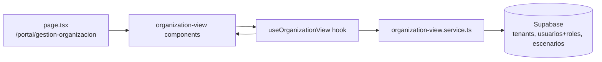

## Context

The admin route `/portal/gestion-organizacion` currently renders placeholder text and does not provide tenant organization visibility. The proposal defines a read-oriented `OrganizationView` capability aligned to `projectspec/designs/06_view_tenant_information.html`, with visual edit controls present but non-functional in this iteration.

Constraints:
- Follow feature-based hexagonal flow: **page → component → hook → service → types**.
- Keep portal shell (`layout`, sidebar, header, role navigation) unchanged.
- Use existing Supabase schema and RLS (no migrations, no new backend endpoints).
- Keep tenant scoping strict via authenticated user profile (`usuarios.tenant_id`).

## Goals / Non-Goals

**Goals:**
- Replace placeholder admin page with organization cards at `/portal/gestion-organizacion`.
- Implement `organization-view` feature slices under `components`, `hooks`, `services`, and `types`.
- Fetch and compose tenant identity/contact/social/context data from existing tables.
- Provide loading, empty, and non-blocking error states.
- Keep design consistent with current portal tokens/styles and the approved HTML reference.

**Non-Goals:**
- Persisting organization edits (save/discard behavior remains unimplemented).
- Changing role authorization logic or global navigation contracts.
- Adding database migrations, external APIs, or new dependencies.

## Decisions

1. **Feature-sliced folder strategy inside portal**
   - Decision: Place all new module code under `organization-view` folders, while keeping shared shell files outside.
   - Rationale: Prevents cross-feature coupling and creates a repeatable standard for future portal features.
   - Alternative considered: Extending existing flat `portal` files (`portal.ts`, `portal.types.ts`) directly. Rejected due to maintainability drift.

2. **Server-first route composition with client hook for stateful UI handling**
   - Decision: Keep page entrypoint in `src/app/portal/(administrador)/gestion-organizacion/page.tsx` and compose feature components; use a dedicated feature hook to manage loading/error/empty rendering data contract.
   - Rationale: Preserves App Router boundaries and keeps business orchestration out of UI components.
   - Alternative considered: Fetch directly in page/component. Rejected because it violates layer separation.

3. **Service-level aggregation over existing Supabase tables**
   - Decision: Implement `organization-view.service.ts` methods to read:
     - tenant core data (`tenants`),
     - head coach (`usuarios` + `roles`),
     - representative location (`escenarios`).
   - Rationale: Centralizes query behavior and deterministic fallback rules (coach/location selection).
   - Alternative considered: Multiple ad-hoc queries in hook/components. Rejected due to duplication and testing difficulty.

4. **UI includes edit controls as placeholders only**
   - Decision: Render edit-related controls from design without wiring persistence actions.
   - Rationale: Meets approved scope and preserves visual continuity for future edit-phase expansion.
   - Alternative considered: Hide all edit controls. Rejected because it diverges from design reference and stakeholder expectation.

5. **Contract isolation per feature**
   - Decision: Create `organization-view.types.ts` for feature DTO/view models; keep shared role/menu types in existing shared types file.
   - Rationale: Keeps type ownership explicit and limits accidental cross-feature breakage.

### Architecture Diagram

## Risks / Trade-offs

- **[Risk] Joined role filtering behavior may differ depending on Supabase client query constraints** → **Mitigation:** Implement conservative query + in-memory filter fallback for `entrenador` role selection.
- **[Risk] Missing tenant fields create inconsistent card layout** → **Mitigation:** enforce typed placeholders and component-level null-safe rendering.
- **[Risk] Feature split introduces duplicate style patterns** → **Mitigation:** reuse portal shared classes/tokens and keep presentational components small.
- **[Trade-off] Visual edit controls without behavior may confuse users** → **Mitigation:** disable actions clearly and defer enablement to a follow-up change.

## Migration Plan

1. Add feature contracts (`types/portal/organization-view.types.ts`).
2. Add feature service (`services/supabase/portal/organization-view.service.ts`).
3. Add feature hook (`hooks/portal/organization-view/useOrganizationView.ts`).
4. Add card components under `components/portal/organization-view/`.
5. Replace placeholder content in route page with composed `OrganizationView` UI.
6. Update `README.md` route description and portal feature-folder convention.
7. Validate with lint and manual admin QA.

Rollback strategy:
- Revert feature files and restore previous placeholder `gestion-organizacion/page.tsx` if regressions are detected.

## Open Questions

- Should placeholder edit controls be visually disabled (`aria-disabled`) or open a non-functional info tooltip for this iteration?
- For “Head Coach”, should selection prioritize newest or oldest record when multiple active coaches exist (currently deterministic fallback is oldest by `created_at`)?
- Should location prioritize `escenarios.ubicacion` only, or fallback to another tenant-level location source if added later?
