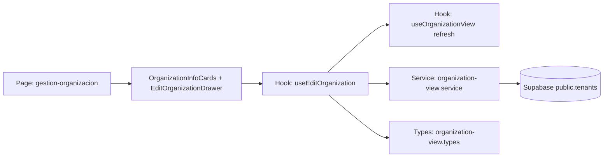

## Context

`US-0007` extends the existing `organization-view` capability at `/portal/gestion-organizacion` from read-only cards to in-place editing for `administrador` users. The current implementation already resolves tenant-scoped organization data; this change adds a right-side drawer form pattern (`projectspec/designs/07_edit_organization.html`) and persists edits only to `public.tenants`.

Key constraints:
- Maintain hexagonal layering and feature slice boundaries from `projectspec/03-project-structure.md`.
- Keep role-gated access and existing portal shell/navigation behavior unchanged.
- Scope read/write data operations to `public.tenants` only.
- Implement predictable loading, validation, success, and error states.

## Goals / Non-Goals

**Goals:**
- Enable admins to open/close an edit drawer from organization management using CTA, close icon, overlay click, `Esc`, and cancel action.
- Prefill editable tenant fields and validate/normalize values before submit.
- Persist updates through service layer (`hooks` and `services`, not pages/components).
- Refresh organization cards in place after successful update and show user feedback.
- Preserve existing folder and naming conventions for `organization-view` slice.

**Non-Goals:**
- Editing non-tenant entities (coaches/trainers/scenarios/roles/system metadata).
- Adding new routes, changing role matrix, or redesigning global portal navigation.
- Introducing new backend REST endpoints or new external dependencies.

## Decisions

1. **Keep all edits inside the existing `organization-view` capability**
   - **Decision:** Treat this as a requirement extension of `organization-view` instead of creating a new capability.
   - **Rationale:** The use case is a direct evolution of the existing organization management screen and reuses the same data domain and route.
   - **Alternative considered:** Separate `organization-edit` capability. Rejected to avoid unnecessary capability fragmentation.

2. **Adopt page → component → hook → service → types orchestration**
   - **Decision:** Route layer wires feature state; components remain presentational; `useEditOrganization` handles interaction lifecycle; service performs Supabase reads/updates; types define contracts.
   - **Rationale:** Enforces existing architecture rules and reduces coupling between UI and persistence.
   - **Alternative considered:** Component-level data mutation. Rejected due to architecture violations and weaker testability.

3. **Use drawer-local form state initialized from tenant read model**
   - **Decision:** On open, initialize form values from current organization data and keep local editable state until submit.
   - **Rationale:** Avoids accidental global state mutation and simplifies cancel/close behavior.
   - **Alternative considered:** Live two-way binding to main read model. Rejected due to risk of stale/partial UI updates.

4. **Validation and normalization strategy in hook boundary**
   - **Decision:** Validate required/format constraints before service call; normalize trimmed strings and convert empty optional values to `null`.
   - **Rationale:** Centralizes business rules and keeps UI components focused on rendering.
   - **Alternative considered:** Service-only validation. Rejected because user feedback would be delayed and less contextual.

5. **Post-save refresh via existing organization-view refresh path**
   - **Decision:** Reuse or extend `useOrganizationView` refresh mechanism after successful update.
   - **Rationale:** Ensures cards reflect persisted data without full route reload.
   - **Alternative considered:** Optimistic local patch only. Rejected to avoid divergence from source of truth.

6. **No new dependency for modal/form management**
   - **Decision:** Implement drawer interactions with existing React/Next patterns and current UI primitives.
   - **Rationale:** Scope is moderate and current stack already supports required behavior.
   - **Alternative considered:** Add external dialog/form library. Rejected to minimize complexity.

### Architecture Diagram

## Risks / Trade-offs

- **[Risk] Drawer UX regressions in keyboard/focus behavior** → **Mitigation:** Add explicit `Esc` handling, focus management checks, and manual QA for keyboard-only flow.
- **[Risk] Tenant scoping mistakes could update wrong record** → **Mitigation:** Resolve `tenant_id` from authenticated context and update a single row by `id = tenant_id`.
- **[Risk] Incomplete normalization causes inconsistent nullable fields** → **Mitigation:** Centralize normalization in hook submit path and enforce typed payload.
- **[Risk] Concurrent updates can cause stale form data** → **Mitigation:** Re-fetch view model after save and source initial values from latest read model on drawer open.
- **[Trade-off] Re-fetch after save adds one extra query** → **Mitigation:** Keep payload/query narrow and only refetch when save succeeds.

## Migration Plan

1. Extend `types/portal/organization-view.types.ts` with edit form and payload/result contracts.
2. Extend `services/supabase/portal/organization-view.service.ts` with tenant read-for-edit and update methods.
3. Create `hooks/portal/organization-view/useEditOrganization.ts` and integrate with existing organization view hook.
4. Create UI components `EditOrganizationDrawer.tsx` and `EditOrganizationForm.tsx`; wire trigger in `OrganizationInfoCards.tsx` and page.
5. Validate close mechanics, validation rules, submit lifecycle, and post-save refresh behavior.
6. Run lint/typecheck for touched scope and execute manual QA checklist for admin flow.

Rollback strategy:
- Revert edit-specific wiring (drawer trigger + new components/hook/service methods) while keeping existing read-only organization cards intact.

## Open Questions

- Should success feedback use the existing toast primitive or an inline banner in the organization module?
- Should unchanged fields be submitted as full payload or minimal diff-only payload in this iteration?
- Is there an existing shared URL/phone validation utility to reuse, or should validation remain localized in `useEditOrganization`?