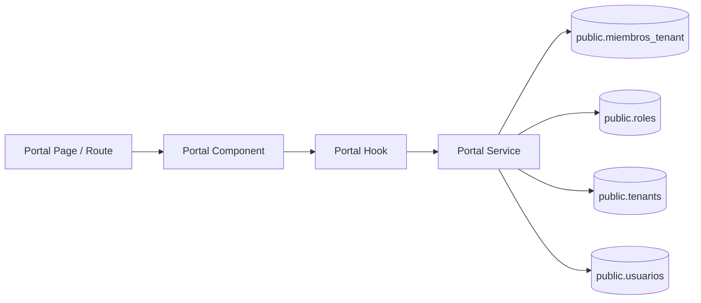

## Context

The current portal context resolves tenant and role from direct columns in `public.usuarios`, which does not support multi-tenant membership and conflicts with the target relational model in `miembros_tenant`. This change must preserve current `/portal` shell behavior while moving source-of-truth role/tenant resolution to membership joins, and must keep architecture boundaries (`page -> component -> hook -> service -> types`) defined in `projectspec/03-project-structure.md`.

Stakeholders are authenticated end users (administrador, entrenador, usuario), product owners expecting stable onboarding defaults, and engineering teams maintaining Supabase migrations and portal service contracts.

## Goals / Non-Goals

**Goals:**
- Establish `miembros_tenant` as the source of truth for tenant-role assignments.
- Guarantee default onboarding into tenant `public` with role `usuario` through conflict-safe seed/trigger logic.
- Refactor portal context resolution to derive role/tenant from memberships (not `usuarios` direct tenant/role fields).
- Preserve existing `/portal` welcome + header UX while restricting navigation to `Organizaciones Disponibles`.
- Keep implementation aligned with feature-slice hexagonal boundaries.

**Non-Goals:**
- Building tenant-switching UX for users with multiple memberships.
- Redesigning portal shell visuals or introducing new routes beyond scoped requirements.
- Reworking unrelated domain tables or authentication providers.

## Decisions

1. **Membership-centric data model**
   - Decision: Treat `public.miembros_tenant(tenant_id, usuario_id, rol_id)` as canonical role/tenant context with uniqueness on (`tenant_id`, `usuario_id`).
   - Rationale: Enables many-tenants-per-user and role-per-tenant semantics.
   - Alternative considered: Keep fallback duplicated columns in `usuarios`.
   - Why not: Creates divergence and synchronization risk.

2. **Default provisioning in SQL layer (seed + trigger function)**
   - Decision: Ensure `public` tenant + required roles exist in seed path and provision default membership (`public`, `usuario`) for each new auth user using idempotent conflict-safe SQL.
   - Rationale: Centralizes onboarding guarantees closest to persistence and reduces app-layer race conditions.
   - Alternative considered: Provision membership only in application signup flow.
   - Why not: Misses users created by other auth paths and is less deterministic.

3. **Tenant-scoped membership resolution in service layer**
   - Decision: Resolve user access as role-per-tenant from `miembros_tenant`, and keep context tenant-scoped so each user has a role inside each tenant. Tenant-specific subfolders/routes (`[tenant_id]`) will be introduced in a later change for explicit tenant selection.
   - Rationale: Aligns with multi-tenant behavior while keeping this change focused on membership correctness and onboarding defaults.
   - Alternative considered: Keep global role resolution independent of tenant context.
   - Why not: Conflicts with role-per-tenant semantics and future tenant-scoped navigation.

4. **Temporary menu simplification at shared component/config boundary**
   - Decision: Restrict rendered portal navigation items to one option (`Organizaciones Disponibles`) through shared menu config/renderer, keeping header and welcome page unchanged, only until tenant-selection UX is introduced.
   - Rationale: Delivers immediate UX requirement while preserving a clear path to role-based tenant views after tenant selection.
   - Alternative considered: Keep role-based menus active in this change.
   - Why not: Exceeds current scope before tenant context is explicitly selected by the user.

5. **Type contracts updated to membership-backed profile**
   - Decision: Update portal contracts so resolved role/tenant are represented as membership-derived context, not direct `usuarios` ownership fields.
   - Rationale: Prevents accidental coupling to deprecated model assumptions.
   - Alternative considered: Keep legacy type names and map ad hoc.
   - Why not: Increases ambiguity and future regressions.

6. **Drop legacy tenant/role columns from `usuarios` in this change**
   - Decision: Fully drop legacy `usuarios.tenant_id` and `usuarios.rol_id` in this change (not retained as nullable deprecated fields).
   - Rationale: Enforces a single source of truth in memberships and avoids dual-write/dual-read drift.
   - Alternative considered: Temporary nullable deprecation period.
   - Why not: Extends ambiguity and increases migration complexity.

### Architecture Diagram

## Risks / Trade-offs

- [Risk] Existing code paths may still read `usuarios.tenant_id` / `usuarios.rol_id` implicitly. → Mitigation: grep-driven audit of portal services/types and replace with membership resolver.
- [Risk] Duplicate default membership creation during concurrent onboarding events. → Mitigation: enforce unique constraint and `ON CONFLICT DO NOTHING` semantics.
- [Risk] Ambiguity during transition to tenant-specific context selection. → Mitigation: keep current scope limited to membership correctness + simplified menu, and define tenant-subfolder (`[tenant_id]`) selection behavior in a follow-up change.
- [Risk] Navigation regressions after menu restriction. → Mitigation: keep change isolated to shared menu config and validate `/portal` render snapshots manually.
- [Trade-off] Simplifying to one nav item reduces discoverability of future modules. → Mitigation: treat as intentional temporary product scope and re-expand via later change.

## Migration Plan

1. Update base migration/seed assets to model membership as canonical tenant-role relation and include required role catalog.
2. Add/confirm idempotent SQL function/trigger path that guarantees `usuarios` row + default membership (`public`, `usuario`) on user creation.
3. Backfill/verify existing tenant-role context can be resolved from memberships, then drop legacy `usuarios.tenant_id` and `usuarios.rol_id`.
4. Refactor portal services (`portal.ts`, `portal/index.ts`, organization-view service) to resolve role/tenant from memberships.
5. Update portal types/contracts and bootstrap route to consume membership-backed context.
6. Restrict portal menu to one item while preserving current welcome/header components.
7. Validate signup/login/portal bootstrap flow in local Supabase environment.

Rollback strategy:
- Revert application-level resolver changes first (types/services/menu).
- If DB migration causes issues, roll back last migration step and restore previous seed behavior.
- Re-run seeds to reestablish prior baseline for local/staging.

## Open Questions

- None for this artifact. Active context remains tenant-scoped, legacy direct tenant/role columns in `usuarios` are dropped in this change, and menu simplification is temporary until tenant-selection UX and tenant subfolders (`[tenant_id]`) are introduced.
