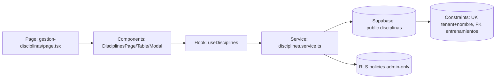

## Context

La propuesta `us0011-manage-disciplines-feature` define una capacidad nueva de administración de disciplinas para el rol administrador, dentro de rutas tenant-scoped del portal. El proyecto sigue arquitectura hexagonal por capas y feature slices (`page -> component -> hook -> service -> types`) según `projectspec/03-project-structure.md`.

Estado actual relevante del modelo (validado en `supabase/migrations`):
- `public.disciplinas` ya existe con campos `id`, `tenant_id`, `nombre`, `descripcion`, `activo`, `created_at`, `updated_at`.
- Existe restricción única `disciplinas_tenant_nombre_uk (tenant_id, nombre)`.
- `public.entrenamientos.disciplina_id` referencia `public.disciplinas(id)` con `on delete restrict`.
- RLS está habilitado y hay política `select` para `disciplinas`, pero no hay políticas explícitas `insert/update/delete` equivalentes a las usadas en escenarios.

Stakeholders:
- Administradores de tenant (usuarios finales).
- Equipo frontend (feature slice disciplinas).
- Equipo de datos/backend (migraciones y políticas RLS).

## Goals / Non-Goals

**Goals:**
- Implementar CRUD de disciplinas para administradores en `/portal/orgs/[tenant_id]/gestion-disciplinas` con tabla y modal lateral.
- Mantener separación por capas: la página solo compone UI; la lógica vive en hooks; acceso a datos en services; contratos en types.
- Alinear la implementación con el diseño de modelo en `supabase/migrations` y explicitar cómo se consumen restricciones `unique` y `FK`.
- Definir una estrategia de seguridad y consistencia para mutaciones tenant-scoped.

**Non-Goals:**
- Rediseñar entidades fuera de disciplinas/entrenamientos o alterar el dominio completo de entrenamientos.
- Incorporar analítica, auditoría histórica o nuevos flujos no administrativos.
- Introducir APIs REST externas nuevas cuando el patrón hook -> service con Supabase cubre el alcance.

## Decisions

### 1) Estructura por capas y feature slice disciplinar
**Decisión:** Implementar la feature en:
- `src/app/portal/orgs/[tenant_id]/(administrador)/gestion-disciplinas/page.tsx`
- `src/components/portal/disciplines/*`
- `src/hooks/portal/disciplines/*`
- `src/services/supabase/portal/disciplines.service.ts`
- `src/types/portal/disciplines.types.ts`

**Rationale:** Mantiene consistencia con slices existentes (`scenarios`) y evita acoplamiento de UI con acceso a datos.

**Alternativas consideradas:**
- Lógica directamente en `page.tsx`: descartado por violar reglas de arquitectura.
- API routes intermedias: descartado en esta fase por complejidad adicional sin necesidad funcional inmediata.

### 2) Modelo de datos: reutilizar tabla `public.disciplinas` y restricciones actuales
**Decisión:** No crear nuevas tablas para CRUD básico de disciplinas; usar la tabla existente y sus constraints.

**Rationale:** La tabla ya cubre los campos requeridos por la historia y la restricción `disciplinas_tenant_nombre_uk` resuelve unicidad por tenant.

**Alternativas consideradas:**
- Agregar columna `categoria` persistida: se descarta en este cambio; se mantiene como campo derivado/presentacional.
- Duplicar estado en tabla auxiliar: descartado por sobreingeniería.

### 3) Seguridad de mutaciones: crear migración focalizada para políticas admin-only en `disciplinas`
**Decisión:** Agregar una migración SQL nueva para `insert/update/delete` de `public.disciplinas` restringida a tenants administrados por el usuario autenticado, reutilizando `public.get_admin_tenants_for_authenticated_user()`.

**Rationale:** Actualmente solo hay policy `select`; para habilitar CRUD seguro y coherente con `escenarios`, se requieren políticas de mutación con `using`/`with check` por `tenant_id`.

**Alternativas consideradas:**
- Confiar solo en filtros desde frontend/service: descartado por insuficiente seguridad en DB.
- Usar `service_role`: descartado para flujo de usuario autenticado.

### 4) Estrategia de errores de negocio y constraints
**Decisión:** Mapear errores SQL en service/hook a mensajes UX explícitos:
- Violación de unique (`tenant_id + nombre`) → mensaje de nombre duplicado en tenant.
- Restricción FK `entrenamientos_disciplina_id_fkey` (`on delete restrict`) → mensaje de dependencia activa al intentar eliminar.

**Rationale:** La UX requiere “no silent failures” y feedback claro.

**Alternativas consideradas:**
- Mensaje genérico para todos los errores: descartado por baja claridad.

### 5) Estrategia de actualización de lista post mutación
**Decisión:** Usar refetch controlado después de create/update/delete en hook principal (`useDisciplines`) para priorizar consistencia con RLS y restricciones de DB.

**Rationale:** Reduce riesgo de divergencia local con estado real del backend y simplifica primera versión.

**Alternativas consideradas:**
- Optimistic update completo: pospuesto para una iteración posterior.

### 6) Navegación por rol
**Decisión:** Extender la capacidad `portal-role-navigation` para incluir el acceso de administrador a `gestion-disciplinas` en el menú tenant-scoped.

**Rationale:** La feature debe ser descubrible y consistente con el enrutamiento protegido por rol.

**Alternativas consideradas:**
- Dejar acceso solo por URL directa: descartado por mala UX y baja discoverability.

### Arquitectura de interacción (alto nivel)

## Risks / Trade-offs

- [Riesgo] Falta de policies `insert/update/delete` en `disciplinas` bloquea CRUD aunque la UI esté lista.  
  → Mitigación: crear migración focalizada al inicio de implementación y validar con usuario administrador real.

- [Riesgo] Manejo incompleto de códigos de error de constraints en Supabase genera mensajes confusos.  
  → Mitigación: normalizar mapeo de errores en service y cubrir casos de `unique`/`restrict`.

- [Riesgo] Refetch tras cada mutación puede impactar performance en listas grandes.  
  → Mitigación: mantener filtros livianos y evaluar optimización incremental si el volumen crece.

- [Trade-off] Se evita API route dedicada para acelerar entrega.  
  → Mitigación: dejar contratos de service claros para futura extracción a API si cambia el contexto.

## Migration Plan

1. Revisar estado actual en `supabase/migrations` para confirmar estructura y policies existentes de `disciplinas`.
2. Crear nueva migración versionada para:
   - `drop policy if exists` / `create policy` `disciplinas_insert_admin_only`.
   - `drop policy if exists` / `create policy` `disciplinas_update_admin_only`.
   - `drop policy if exists` / `create policy` `disciplinas_delete_admin_only`.
   - Reusar `public.get_admin_tenants_for_authenticated_user()` y validación por `tenant_id`.
3. Aplicar migración en entorno local y validar:
   - Alta/edición/eliminación como administrador de tenant permitido.
   - Bloqueo en tenant no administrado.
   - Error controlado al eliminar disciplina vinculada a entrenamientos.
4. Implementar feature frontend/hook/service/types sobre el modelo validado.
5. Verificar navegación por rol y estados de UI (loading/empty/error).

**Rollback strategy:**
- Revertir solo la migración de policies de disciplinas (eliminar policies nuevas y restaurar estado previo), manteniendo intacto el esquema base.
- Si la reversión es parcial, deshabilitar temporalmente acciones de mutación en UI hasta reestablecer consistencia.

## Open Questions

- ¿La policy `select` de `disciplinas` debe seguir siendo abierta a cualquier autenticado (`using (true)`) o debe endurecerse por tenant en este mismo cambio?
- ¿Se requiere normalización adicional de `nombre` (por ejemplo, case-insensitive uniqueness con índice funcional) o basta con la regla actual?
- ¿`updated_at` se actualizará manualmente desde service o mediante trigger común de auditoría en una migración posterior?