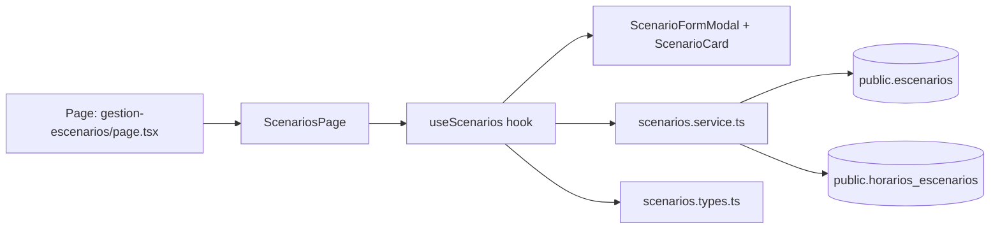

## Context

`US-0010` introduces a complete tenant-admin scenarios management workflow at `/portal/orgs/[tenant_id]/gestion-escenarios`, where today the route exists but does not provide full scenario CRUD-oriented behavior. The proposal defines a new `scenario-management` capability and requires alignment with the project’s hexagonal structure and feature-slice convention (`page -> component -> hook -> service -> types`) documented in `projectspec/03-project-structure.md`.

Current constraints and inputs:
- Visual/interaction direction comes from `projectspec/designs/08_scenarios.html`.
- The route page must remain a thin presentation entrypoint (no direct Supabase/data orchestration).
- Data boundary for this feature is limited to `public.escenarios` and `public.horarios_escenarios`.
- Admin role and tenant scoping behavior from current portal/org scaffolding must remain intact.

Stakeholders:
- Primary: tenant administrators managing training venues/scenarios.
- Secondary: portal consumers that depend on updated scenario availability and metadata.

## Goals / Non-Goals

**Goals:**
- Deliver tenant-scoped scenario listing with loading and empty states in a card-based UI.
- Support create and edit flows through one right-side modal pattern consistent with current portal UX.
- Keep strict architecture separation: page composition only, orchestration in hooks, persistence in services, and typed contracts in domain types.
- Enforce core validations (`nombre`, `tipo`, positive `capacidad` when present, schedule/time constraints, URL format when present).
- Persist and reload scenario data predictably after mutations.

**Non-Goals:**
- Add dependencies on tables other than `escenarios` and `horarios_escenarios` for this story.
- Introduce unrelated route changes, role-matrix redesign, or portal shell redesign.
- Introduce a new backend REST layer unless a later implementation constraint proves it necessary.
- Implement broader scenario analytics/reporting features beyond list/create/edit.

## Decisions

1. **Use a dedicated `scenarios` feature slice across all layers**
   - **Decision:** Add coordinated files under `components/portal/scenarios`, `hooks/portal/scenarios`, `services/supabase/portal/scenarios.service.ts`, and `types/portal/scenarios.types.ts`, while keeping route entrypoint minimal.
   - **Rationale:** Matches existing feature-slice conventions and prevents leakage of business/data logic into UI pages.
   - **Alternatives considered:**
     - Extending generic portal modules with mixed concerns. Rejected because it weakens ownership and testability.

2. **Single form modal component for create/edit modes**
   - **Decision:** Implement one lateral modal component (`ScenarioFormModal`) that switches behavior by mode (`create` | `edit`) and selected scenario state.
   - **Rationale:** Consistent UX, reduced duplication, shared validation and submission lifecycle.
   - **Alternatives considered:**
     - Separate create and edit modals. Rejected due to duplicated form and validation logic.

3. **Hook-centered orchestration with service-only data access**
   - **Decision:** `useScenarios` owns loading, filtering term state, modal open/close state, selected scenario, and submit lifecycle; service methods handle all Supabase interactions.
   - **Rationale:** Preserves architecture hard rules and keeps components purely presentational.
   - **Alternatives considered:**
     - Components calling service directly. Rejected as an architecture violation.

4. **Availability computed from scenario active flag and schedules**
   - **Decision:** Availability badge view-model combines `escenarios.activo` and presence of available schedule rows (`horarios_escenarios.disponible = true`).
   - **Rationale:** Aligns with user story requirement for schedule-aware availability.
   - **Alternatives considered:**
     - Badge based only on `activo`. Rejected because it omits schedule readiness signal.

5. **Validation boundary in hook/form layer before service call**
   - **Decision:** Perform user-facing validation and normalization in hook/form model before submit; service performs persistence and returns typed outcomes/errors.
   - **Rationale:** Immediate feedback and cleaner service contract.
   - **Alternatives considered:**
     - Service-only validation. Rejected because UX feedback becomes less contextual.

6. **Mutation refresh strategy: refetch tenant scenarios after successful writes**
   - **Decision:** After create/edit, close modal and trigger list refetch.
   - **Rationale:** Reliable consistency with persisted state and avoids brittle manual cache patching in initial implementation.
   - **Alternatives considered:**
     - Optimistic updates only. Rejected for higher reconciliation complexity in first iteration.

### Architecture Diagram

## Risks / Trade-offs

- **[Risk] Cross-tenant mutation or read scope leakage** → **Mitigation:** Every service method requires `tenantId` and applies strict tenant filters on read/write queries.
- **[Risk] Modal complexity (mode switching, validation, async state) creates UI regressions** → **Mitigation:** Keep a single source of form state in hook and explicit modal lifecycle transitions.
- **[Risk] Availability semantics may be interpreted differently by stakeholders** → **Mitigation:** Encode current rule in view model and document it in spec scenarios for validation.
- **[Trade-off] Refetch-after-save adds extra query cost** → **Mitigation:** Accept for correctness in MVP; optimize later if performance data requires.
- **[Trade-off] Optional separate `useScenarioForm` hook introduces another abstraction** → **Mitigation:** Keep optional; extract only if form logic exceeds maintainability threshold.

## Migration Plan

1. Create and wire new scenario domain contracts in `src/types/portal/scenarios.types.ts`.
2. Implement `src/services/supabase/portal/scenarios.service.ts` methods:
   - `listScenariosByTenant`
   - `createScenario`
   - `updateScenario`
   - `listScenarioSchedules`
   - `upsertScenarioSchedules`
3. Export service in `src/services/supabase/portal/index.ts` if needed.
4. Implement `src/hooks/portal/scenarios/useScenarios.ts` (and optional `useScenarioForm.ts`) for orchestration.
5. Build presentation components in `src/components/portal/scenarios/` and barrel export.
6. Keep `src/app/portal/orgs/[tenant_id]/(administrador)/gestion-escenarios/page.tsx` as composition-only entry.
7. Update documentation references in `projectspec/03-project-structure.md` and `README.md`.
8. Validate with lint/type checks plus manual QA on list/create/edit and admin/tenant scope behavior.

Rollback strategy:
- Revert scenario feature wiring while retaining existing route scaffold; no DB migration rollback is required for this change scope.

## Open Questions

- Should schedule editing be fully embedded in the first modal iteration or staged after core scenario create/edit fields are stable?
- Should search/filter be client-side on loaded dataset first, or server-driven if data volume grows?
- Should successful save feedback use existing global toast patterns or local inline confirmations in scenarios module?
