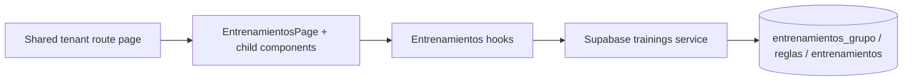

## Context

The change introduces a tenant-scoped trainings management module in `/portal/orgs/[tenant_id]/gestion-entrenamientos` to complete the portal operations suite with a series → instances model. Current architecture rules require strict separation (`page -> component -> hook -> service -> types`), with no direct Supabase access from pages/components and feature-slice co-location by domain.

The data model already supports:
- Series (`entrenamientos_grupo`)
- Recurrence rules (`entrenamientos_grupo_reglas`)
- Instances (`entrenamientos`)
- Exception/sync flags (`es_excepcion_serie`, `bloquear_sync_grupo`)

The design must align UX with existing portal patterns (right-side modal flows and deterministic error messaging) while preserving recurrence integrity and tenant isolation.

### Architecture flow

## Goals / Non-Goals

**Goals:**
- Deliver a render-only route entrypoint for trainings and move all orchestration to hooks/services.
- Support view/create/edit/delete of trainings with explicit scope (`single | future | series`).
- Keep recurrence and exception behavior consistent with DB constraints and sync semantics.
- Standardize deterministic error mapping and UI states (loading/empty/error/submitting).
- Keep implementation fully tenant-scoped and aligned with existing feature slices.

**Non-Goals:**
- Redesign portal shell/sidebar/header beyond feature integration needs.
- Add attendance, enrollment, or analytics capabilities.
- Expose new public REST endpoints; implementation remains through Supabase service contracts.
- Introduce cross-tenant operations or bypass existing RLS assumptions.

## Decisions

### 1) Keep route page as pure composition
- **Decision:** `page.tsx` in shared tenant route only renders `EntrenamientosPage`.
- **Rationale:** Preserves delivery-layer simplicity and respects current architecture rules.
- **Alternative considered:** Putting data fetching directly in route page.
- **Why rejected:** Couples delivery with business logic and duplicates orchestration patterns already standardized in portal features.

### 2) Component split by interaction responsibility
- **Decision:** Use dedicated components for page shell, calendar/list visualization, wizard flow, form modal, and scope modal.
- **Rationale:** Mirrors scenarios/discipline patterns, improves reusability, and keeps each component focused.
- **Alternative considered:** Single monolithic trainings component.
- **Why rejected:** Harder to maintain, test, and evolve for complex scope/mutation flows.

### 3) Centralize state/mutations in hooks
- **Decision:** `useEntrenamientos` orchestrates fetch and mutation lifecycle; specialized hooks handle wizard form and scope behavior.
- **Rationale:** Keeps presentation declarative and encapsulates business rules (validation, mutation sequencing, refresh strategy).
- **Alternative considered:** Local state per component with direct service calls.
- **Why rejected:** Logic duplication and inconsistent error/validation behavior across UI surfaces.

### 4) Service contracts are explicit and scope-aware
- **Decision:** Implement typed service functions for list/create/update/delete and include scope payload for recurring mutations.
- **Rationale:** Makes recurring behavior deterministic and traceable from UI intent to DB mutation.
- **Alternative considered:** Generic mutation endpoint with dynamic payloads.
- **Why rejected:** Weak type safety and higher risk of invalid scope operations.

### 5) Types model both domain rows and view-model payloads
- **Decision:** Define contracts for groups/rules/instances plus wizard values, calendar items, field errors, and scope inputs.
- **Rationale:** Prevents `any` drift and allows compile-time enforcement across layers.
- **Alternative considered:** Derive ad hoc types in components/hooks.
- **Why rejected:** Inconsistent contracts and brittle refactors.

### 6) Validation first in hook layer, DB as final guard
- **Decision:** Enforce date/time/all-day/required validations before submit and map DB errors to deterministic UI messages.
- **Rationale:** Better UX and fewer failed writes while still respecting authoritative DB constraints.
- **Alternative considered:** Rely only on DB constraint errors.
- **Why rejected:** Poor user experience and ambiguous error feedback.

### 7) Refresh strategy favors targeted re-fetch
- **Decision:** Re-fetch affected datasets after mutations (groups/instances in current range) instead of full portal reload.
- **Rationale:** Keeps UI responsive and bounded for medium datasets.
- **Alternative considered:** Full page/router refresh after every mutation.
- **Why rejected:** Unnecessary network/UI churn and weaker interaction continuity.

### 8) Default visualization range is current month with month navigation
- **Decision:** Initial list/calendar view loads current month by default and allows navigation to next/previous months from the first iteration.
- **Rationale:** Gives a predictable default while supporting operational planning beyond the current month.
- **Alternative considered:** Fully user-configurable arbitrary range in v1.
- **Why rejected:** Adds extra configuration complexity for MVP without clear product need.

### 9) Recurrent creation generates all eligible instances immediately
- **Decision:** On recurrent series creation, generate all eligible instances immediately for the configured period.
- **Rationale:** Simplifies consistency for edit/delete scope operations and avoids mixed generated/non-generated states.
- **Alternative considered:** Lazy generation by visible calendar window.
- **Why rejected:** Introduces synchronization complexity and less predictable behavior for administrators.

## Risks / Trade-offs

- [Risk] Scope semantics (`single|future|series`) may be interpreted inconsistently between UI and service layer. → Mitigation: define shared typed payloads and a single scope mapping utility consumed by hooks/services.
- [Risk] Recurrence generation can produce large instance batches for broad ranges. → Mitigation: enforce existing 6-month range constraint and generate in bounded windows.
- [Risk] Editing a series may accidentally overwrite instance exceptions. → Mitigation: service update filters only eligible future/non-cancelled/non-blocked rows.
- [Risk] Timezone/day boundary handling may create off-by-one display issues. → Mitigation: normalize date handling to tenant timezone field and keep conversion centralized.
- [Risk] Parallel modal interactions can trigger duplicate mutations. → Mitigation: lock submit actions during pending mutations and debounce repeated intent.

## Migration Plan

1. Add feature contracts in `types/portal/entrenamientos.types.ts`.
2. Implement Supabase service in `services/supabase/portal/entrenamientos.service.ts` and export wiring in portal index.
3. Implement hooks for orchestration, form, scope, and optional calendar-specific logic.
4. Build feature components and integrate wizard + side modal + scope modal.
5. Replace shared route page with render-only composition to `EntrenamientosPage`.
6. Update docs (`README.md`, `projectspec/03-project-structure.md`) for new feature slice.
7. Validate with lint/typecheck and manual QA of scope and exception behaviors.

**Rollback strategy**
- Revert feature route composition to previous placeholder behavior.
- Revert training service/hook/component files in one change set (no schema migration required for this design step).

## Open Questions

- Is trainer selection constrained by tenant-role membership rules beyond FK validity (business rule not yet explicit in artifacts)?
- Do we require optimistic UI updates for instance edits/deletes, or is post-mutation re-fetch sufficient for MVP?
