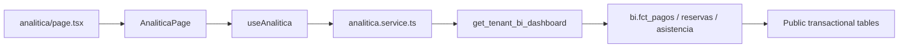

## Context

The portal currently exposes tenant administration through separate screens for subscriptions, bookings, training, and team management. Phase One adds an administrator-only analytics route that combines their operational facts without weakening existing RLS rules or exposing sensitive member data.

The source of truth is the Phase One BI user story. The UI references `projectspec/designs/pencil/grit-arena-v2.pen`, node `zfVKC` (Operations Dashboard): a dark portal shell with a period control in the page header, a compact KPI row, and dense structured content panels. The existing portal shell and `(administrador)` route guard remain unchanged.

The change spans a migration, a protected aggregation boundary, a Supabase portal adapter, a client hook, a feature-sliced UI, an administrator route, and role navigation.

## Goals / Non-Goals

**Goals:**

- Provide tenant administrators with reconciled Revenue, Operations, and Team metrics for an inclusive `America/Bogota` date range.
- Enforce tenant administrator authorization inside the database in addition to the existing route guard.
- Use one aggregate RPC response for the `Resumen`, `Ingresos`, `Operación`, and `Equipo` tabs, preventing redundant requests when navigating tabs.
- Follow the `zfVKC` hierarchy while preserving the current portal shell: header/filter, KPI row, dense panel groups, tables, and responsive states.
- Keep the browser out of the private BI schema and exclude PII from all dashboard payloads.

**Non-Goals:**

- Historical membership snapshots, cost/margin analytics, budget targets, currency configuration, marketplace browsing conversion, and direct payment-to-training attribution.
- New service-role routes, direct browser queries to BI views, changes to transactional RLS policies, and materialized-view refresh jobs.
- Replacing existing subscription, booking, team, or dashboard pages.

## Decisions

### Private BI facts behind one public aggregate RPC

Create a `bi` schema with `fct_pagos`, `fct_reservas`, and `fct_asistencia`, revoke schema usage and view selection from browser roles, and expose only `public.get_tenant_bi_dashboard`.

The RPC uses `SECURITY DEFINER`, `set search_path = public, bi`, explicit `p_date_from <= p_date_to` validation, and `get_admin_tenants_for_authenticated_user()` authorization. It raises `22007` for invalid ranges and `42501` for unauthorized tenant access.

This avoids a broad direct-RLS expansion while allowing a coherent cross-table aggregate. A direct browser query strategy was rejected because every visualization would need repeated joins and would make tenant scoping, PII minimization, and metric consistency difficult to audit. A service-role HTTP route was rejected because it would duplicate authorization logic and violates the local convention that privileged service-role clients belong only in route handlers when genuinely necessary.

### Stable metric grain before aggregation

`fct_pagos` has one payment row, `fct_reservas` has one reservation row, and `fct_asistencia` has one attendance row. `fct_reservas` must never join the multi-row service ledger, so booking counts cannot inflate. Attendance is not inferred from bookings.

Recognized revenue filters `estado = 'validado'`. Capacity consumption filters only cancelled bookings out. Membership metrics use the current `miembros_tenant.estado` state and explicitly do not claim historical state trends.

This creates a reusable semantic boundary for later BI phases. Recomputing every metric directly in React was rejected because it would duplicate definitions and produce inconsistent totals across tabs.

### One response per applied date range

`useAnalitica` owns `America/Bogota` date-range state and calls the RPC only after a valid filter is applied. It retains the last successful result while refreshing. The feature root owns local tab state and passes the same response to each panel.

Tabs are not URL routes in Phase One; this preserves filter state, avoids extra data requests, and fits the operational single-page dashboard reference. Deep-linking a selected tab was considered but deferred because it adds state synchronization without a current user requirement.

### Accessible dashboard tabs and `zfVKC` visual reference

The page places the date filter above the tab list. `Resumen` is the default tab and surfaces six cross-domain KPIs. `Ingresos`, `Operación`, and `Equipo` render their full detailed sections only when selected. Tabs implement the WAI-ARIA pattern with left/right/home/end keyboard behavior.

The visual composition uses the existing portal dark theme and the reference node's density: page title and time filter, compact KPI cards, stacked analytical panels, and data tables. It does not reproduce decorative glow elements or create a separate sidebar because the existing portal shell already owns navigation.

### America/Bogota as the temporary analytics timezone

The tenant model has no timezone configuration. The migration and UI consistently bucket timestamps in `America/Bogota` and show date-only values in that zone. A future reporting-contract extension may pass the browser IANA timezone to support user-local presentation and period boundaries; it is deferred so browser location cannot alter Phase One totals.

Using browser local time as the Phase One calculation source was rejected because client location would change the same tenant's dashboard totals.

## Risks / Trade-offs

- [Security-definer scope error] → Use a fixed search path, revoke default public access, check administrator membership before reads, return only approved fields, and test cross-tenant access explicitly.
- [Slow live aggregates as volume grows] → Constrain all fact reads by tenant and date, add only missing supporting indexes, cap rankings/alerts/drill-downs, and profile before introducing materialized facts.
- [Metric totals drift from management screens] → Centralize definitions in one RPC and validate fixture totals against direct SQL before release.
- [No tenant timezone] → Apply and document `America/Bogota` consistently in the migration and UI; defer browser-timezone reporting to a later reporting-contract extension.
- [Null capacity and attendance gaps misread as zero] → Return null occupancy when its denominator is zero, count missing capacity separately, and keep attendance registration separate from no-show.
- [Design divergence from portal] → Treat `zfVKC` as hierarchy and density reference only; reuse portal visual tokens and shell components.

## Migration Plan

1. Inspect current indexes locally and write `20260921130000_tenant_bi_phase_one.sql` with the private schema, fact views, aggregate RPC, grants/revokes, and only missing indexes.
2. Apply the migration to the local Supabase database only; do not push it to the remote Supabase server during this change preparation.
3. Verify direct `authenticated` access to `bi` fails and verify the RPC succeeds only for an administrator of the requested tenant.
4. Add types, service, hook, UI slice, page, and navigation entry; reconcile fixture data against SQL totals.
5. Roll back, if required, by dropping the public RPC, dropping the private views/schema, and dropping only indexes created by this migration. Frontend code can remain deployed safely only after the route/menu entry is also reverted because its RPC call would otherwise fail.

## Open Questions

- The application currently has no tenant timezone. Phase One deliberately uses `America/Bogota`; a future phase may pass the browser IANA time zone for user-local presentation and period boundaries.
- The implementation must inspect the exact current payment-state constraints to ensure `validado` remains the only recognized-revenue state. If the contract changes, update the semantic definition and tests in the same change.
