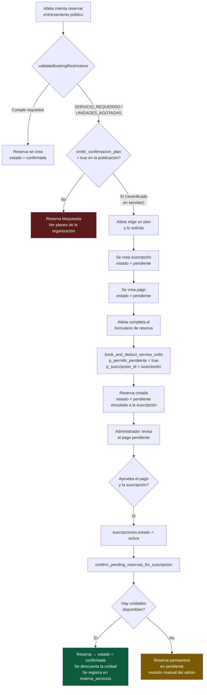
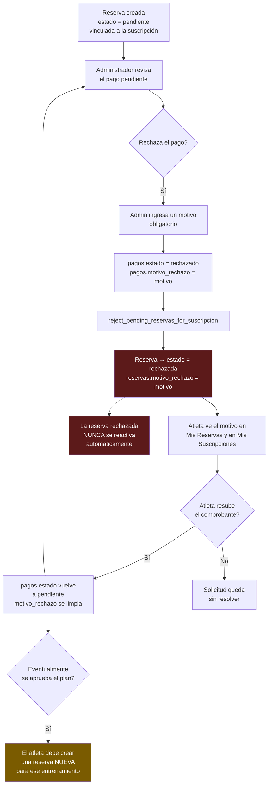

# US-0106 — Flujograma: Omitir confirmación de plan al publicar entrenamientos

Diagrama de los dos escenarios posibles una vez que un atleta reserva un entrenamiento público publicado con `omitir_confirmacion_plan = true` y no cuenta con el plan/servicio requerido.

## Escenario 1 — El administrador aprueba el plan pendiente

## Escenario 2 — El administrador rechaza el pago pendiente

## Notas clave

- La validación de `omitir_confirmacion_plan` se hace **siempre en el servidor** (`reservas.service.ts` `create()`), nunca confiando únicamente en el flag enviado por el cliente.
- Todas las demás restricciones (horario, estado de membresía, nivel de disciplina, cupo, reserva duplicada) se siguen validando igual que hoy; solo se omite el requisito de plan/servicio.
- Las reservas en estado `rechazada` se excluyen de los conteos de cupo y de la validación de reserva duplicada, igual que las `cancelada`.
- Cancelar una suscripción que todavía está `pendiente` (en vez de rechazar el pago) dispara la misma cascada de rechazo (`reject_pending_reservas_for_suscripcion`).

Referencias: [US-0106](../userstory/us0106-skip-plan-confirmation-public-trainings.md) · `openspec/changes/skip-plan-confirmation-public-trainings/`
