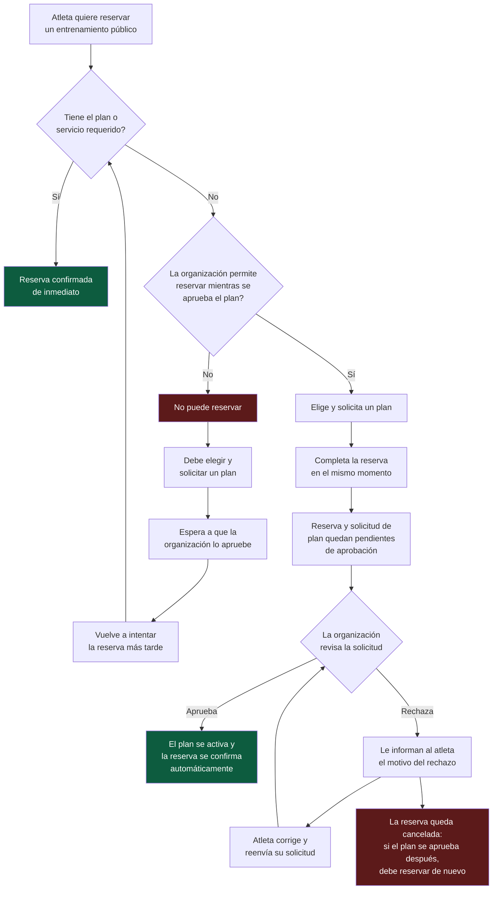

# US-0106 — Flujo a alto nivel: reserva de un entrenamiento público sin plan activo

Vista general del proceso, sin detalles técnicos, comparando qué pasa cuando la organización **permite reservar sin confirmar el plan** y cuando **no lo permite**.

## Resumen de los dos caminos

| | Organización **no** permite reservar sin plan | Organización **sí** permite reservar sin plan |
|---|---|---|
| Atleta sin plan | No puede reservar hasta que le aprueben el plan | Puede reservar de inmediato |
| Reserva | Se crea solo después de tener el plan aprobado | Se crea junto con la solicitud del plan, ambas pendientes |
| Aprobación del plan | El atleta debe volver a reservar manualmente | La reserva se confirma sola |
| Rechazo del plan | No aplica (nunca llegó a reservar) | La reserva se cancela; el atleta ve el motivo y, si corrige el plan, debe reservar de nuevo |

Referencias: [US-0106](../userstory/us0106-skip-plan-confirmation-public-trainings.md) · [Flujograma técnico](./us0106-skip-plan-confirmation-flowchart.md)
