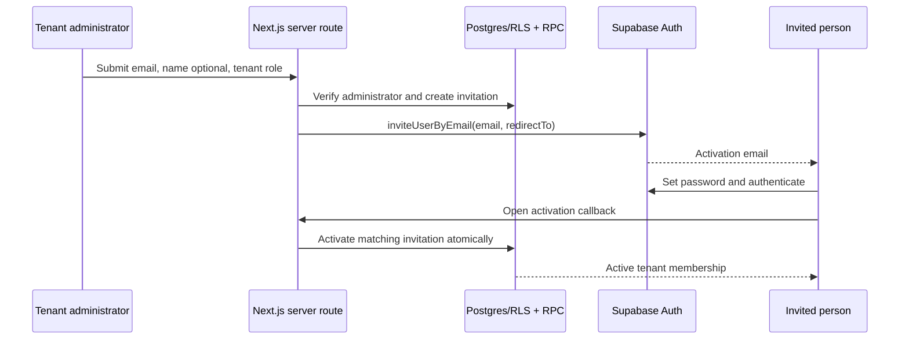
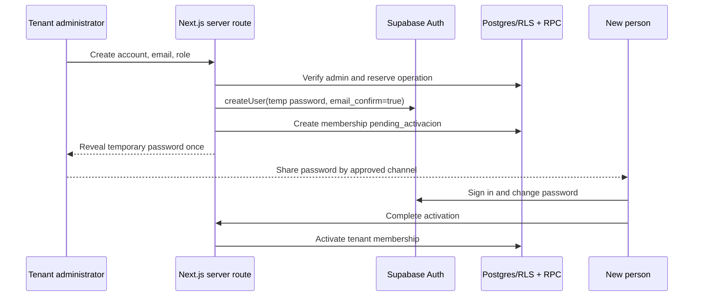

# US-0114 - Admin Create and Invite Tenant Members

## Objective

Allow an `administrador` to add a person to their organization by email and intended tenant role through two controlled modes: an email invitation or an administrator-provisioned account with a temporary password and auto-confirmed email. The latter is allowed only for organizations that verify the person's identity through an external process.

## Current Architecture Assessment

### Existing model

The current design correctly separates the global user identity from the tenant relationship:

- `auth.users` is the authentication identity managed by Supabase Auth.
- `public.usuarios` is the global application profile. It references `auth.users` and is created by the authentication provisioning flow.
- `public.miembros_tenant` is the tenant-scoped relationship. It already supports `tenant_id`, `usuario_id`, `rol_id`, and a tenant-scoped `estado`.
- `roles` and `get_admin_tenants_for_authenticated_user()` are the authorization basis for the administrator area and its RLS policies.
- The access-request flow in `miembros_tenant_solicitudes` lets an already authenticated user request membership; an administrator can accept it and insert the membership.

### Consequence

An administrator can manage an existing membership but cannot provision a new person: browser-side code cannot call `auth.admin.*`, and `usuarios` is not directly insertable. This is an appropriate security boundary. Account provisioning, including temporary passwords and auto-confirmation, requires a server-only privileged operation; giving clients direct access to Supabase's `service_role` would compromise all Auth and database security.

## Recommended Architecture

Support two tenant-configurable onboarding modes through a common server-only provisioning boundary:

- **Invitation with deferred activation** is the default. The recipient proves control of their inbox and chooses their password.
- **Admin-provisioned temporary password** is an operational exception. The server creates an auto-confirmed Auth account, creates a tenant membership in `pendiente_activacion`, and presents the generated password exactly once to the administrator for secure out-of-band delivery.

Supabase Auth remains the identity owner; a server-only endpoint orchestrates either mode and the tenant-scoped membership.

### Server boundary

Create route handlers such as `POST /api/portal/orgs/[tenantId]/invitations` and `POST /api/portal/orgs/[tenantId]/members/provision` that:

1. Resolves the caller from the server Supabase session.
2. Calls a database RPC to verify that the caller is an administrator of `tenantId`, validate that `rol_id` is assignable, and reserve the requested operation.
3. Uses a server-only Supabase admin client for either `auth.admin.inviteUserByEmail()` or `auth.admin.createUser({ email, password, email_confirm: true })`.
4. For temporary-password mode, generates the password server-side with a cryptographically secure generator. The administrator cannot supply it, and the application never persists, logs, audits, emails, or returns it after the initial response.
5. Stores the returned Auth user id when available and records the delivery result or provisioning outcome.
6. Returns an intentionally generic response for an email address that may already exist, preventing user enumeration.

The `SUPABASE_SERVICE_ROLE_KEY` belongs only in server environment variables. It must not appear in `NEXT_PUBLIC_*`, client components, hooks, logs, error responses, or Next.js client bundles.

Auth creation and database membership insertion cannot share one database transaction. Treat provisioning as a saga: reserve the operation first, create Auth identity second, insert membership third, and compensate by deleting the newly created Auth identity when the membership insert fails. Persist retryable failure state for operational review.

### Data model

Add `public.invitaciones_tenant` rather than overloading `miembros_tenant_solicitudes`, because an invitation is initiated by an administrator and may refer to a person who does not yet have an account.

Suggested fields:

| Field | Purpose |
|---|---|
| `id uuid` | Invitation identifier |
| `tenant_id uuid` | Target organization |
| `email citext` | Normalized recipient email |
| `rol_id uuid` | Role selected by the administrator |
| `estado text` | `pendiente`, `enviada`, `aceptada`, `cancelada`, `expirada`, `fallida` |
| `auth_user_id uuid nullable` | Auth identity once known |
| `creada_por uuid` | Inviting administrator |
| `expires_at timestamptz` | Expiration, initially 7 days |
| `accepted_at`, `cancelled_at`, `last_sent_at` | Lifecycle audit timestamps |
| `created_at`, `updated_at` | Operational audit timestamps |

Constraints and indexes:

- Foreign keys to `tenants`, `roles`, `usuarios` (`creada_por`), and optionally `auth.users` only if the project accepts that cross-schema dependency.
- A partial unique index on `(tenant_id, lower(email))` for active states (`pendiente`, `enviada`) prevents duplicate invitations and makes resend idempotent.
- Index `(tenant_id, estado, created_at desc)` for the administrator list.
- Index `(auth_user_id, estado)` for activation lookup.
- Check that `expires_at > created_at` and restrict the state vocabulary.

Do not create a `miembros_tenant` row until activation succeeds. Pending invitations are not memberships and must not grant portal access, billable subscriptions, bookings, or role permissions.

For admin-provisioned accounts, use the existing `miembros_tenant.estado` with an additional controlled value `pendiente_activacion`. Add a provisioning audit table, for example `altas_administradas_tenant`, that records `tenant_id`, `usuario_id`, `rol_id`, `creada_por`, `metodo = 'contrasena_temporal'`, `estado`, `activated_at`, and timestamps. It must never contain the password or password-derived data.

All authorization policies and domain queries that grant tenant capabilities must exclude `pendiente_activacion`. This is essential: hiding portal routes alone is insufficient because the application currently has browser-side Supabase access.

### Activation transaction

Implement a `security definer` RPC, for example `activar_invitacion_tenant(p_invitation_id uuid)`, callable only by an authenticated person. In one transaction it must:

1. Lock the invitation row with `FOR UPDATE`.
2. Require `estado IN ('pendiente', 'enviada')`, `expires_at > now()`, and an invitation email equal to the authenticated user's verified email, compared case-insensitively.
3. Ensure the authenticated identity has its `usuarios` profile row. The existing Auth provisioning trigger should normally have created it.
4. Insert `miembros_tenant` with the invitation's tenant and role using `ON CONFLICT (tenant_id, usuario_id) DO NOTHING`.
5. Mark the invitation `aceptada`, set `auth_user_id`, `accepted_at`, and `updated_at`.
6. Return the resolved tenant and membership identifier.

This makes repeated callback visits safe and prevents a user from redeeming an invitation for another email or tenant.

### Temporary-password activation

The password-change view calls `supabase.auth.updateUser({ password })`, then the authenticated user calls a server endpoint that activates the pending membership. The endpoint verifies that the caller owns the pending provisioning record and applies activation atomically through an RPC.

The endpoint cannot cryptographically prove that the password was changed merely from a client assertion. Therefore, `pendiente_activacion` is a business-access gate, not a substitute for a password-history policy. For stronger assurance, route password changes through a server-owned identity workflow with a dedicated identity provider capability, or require an administrator to activate the membership after confirming the change through an external process.

## User Experience

Add an "Agregar miembro" action to `gestion-equipo` for administrators:

- Required fields: email and tenant role.
- Optional fields: name and a note visible only to tenant administrators.
- The form offers `Invitacion por email` by default and `Cuenta con contrasena temporal` only when the tenant setting permits managed provisioning.
- In temporary-password mode, the application generates the password, reveals it once in a confirmation view, and requires the administrator to confirm that it will be shared through an approved channel. There is no later "view password" action.
- The created member is visibly marked `Pendiente de activacion`; it cannot access tenant resources until activation.
- Before sending, warn when an active member with the same email already exists in the tenant.
- The team view has an "Invitaciones" tab with statuses, expiration date, resend, and cancel actions.
- Existing account: the recipient authenticates and accepts the invitation; never automatically attach an authenticated existing account solely because an administrator entered its email.
- New account: the Supabase invitation email takes the recipient to password setup, then the same acceptance screen.
- Expired invitations require explicit resend, issuing a new expiry. Cancellation invalidates the record immediately.

The existing self-service request flow remains. It serves the inverse case: a user asks to join an organization. Invitations and requests should be displayed separately and never transition one another's state implicitly.

## Alternatives Considered

| Alternative | Advantages | Disadvantages | Decision |
|---|---|---|---|
| Invite + deferred activation | No administrator-held passwords; works for new and existing users; preserves tenant isolation; traceable lifecycle | Requires table, RPC, route, email configuration, and callback UX | Default |
| Admin creates auto-confirmed user with generated temporary password | Works when email delivery is unavailable; immediate operational enrollment; supports verified in-person onboarding | Password disclosure, weaker proof of email ownership, forced-change assurance limits, takeover and support risk | Supported only as a tenant-controlled exception |
| Admin adds only registered users | Lowest implementation cost; uses current membership RLS | High onboarding friction; email matching/search leaks; cannot provision new people | Keep only as a supplementary lookup action |
| Extend access requests for invitations | Reuses an existing table and UI | Semantically inverted actors; FK requires `usuarios`; weak lifecycle and auditing | Reject |
| Direct browser use of `service_role` | Minimal perceived wiring | Full database/Auth compromise if exposed | Reject absolutely |

## Benefits

- Preserves the current identity-versus-membership separation.
- Reduces onboarding from self-registration plus request approval to one administrator action plus recipient consent.
- Supports both net-new and existing accounts without identity duplication.
- Provides an auditable lifecycle for compliance, support, and operational follow-up.
- Keeps role assignment tenant-scoped and compatible with existing `miembros_tenant` authorization.
- Supports controlled offline or in-person onboarding where the organization is responsible for identity verification.

## Risks and Mitigations

| Risk | Impact | Mitigation |
|---|---|---|
| Service-role leakage | Critical compromise of Auth and data | Server-only client, secrets scan, no client imports, least-privilege route tests |
| Privilege escalation through crafted `tenantId` or `rolId` | Unauthorized membership or role | Authorize inside RPC, not only in the route; validate assignable roles and tenant ownership |
| Email enumeration | Privacy disclosure | Generic responses, rate limits, and no recipient-existence details in UI/API |
| Invitation replay or race | Duplicate/incorrect memberships | Row lock, expiry validation, partial unique index, idempotent conflict handling |
| Email link delivered to the wrong inbox | Account takeover | Require authenticated verified-email match before activation; do not activate from opaque link alone |
| Temporary password disclosed or reused | Account takeover | Generate server-side, show once, prohibit logs/storage/email, require change before tenant access, and provide immediate credential reset |
| Auto-confirmed unverified email | Loss of inbox-ownership proof | Restrict the mode to verified operational onboarding; display its security impact and retain an audit event |
| Client bypasses password-change screen | Unauthorized tenant use before credential update | Enforce `pendiente_activacion` in RLS and service queries, not only middleware or UI |
| Partial Auth/database provisioning | Orphan identity or inaccessible account | Saga state, compensation deletion, idempotent retries, and an administrator failure queue |
| Stale invitation has an outdated role | Excess privileges | Store intended role; allow cancel/resend; optionally require a final admin review for privileged roles |
| Cross-tenant global-profile mutation | Data integrity/privacy | Invitation flow only creates membership; do not allow it to update `usuarios` fields |
| Existing broad membership read policy | Member-directory data exposure | Independently tighten `miembros_tenant` SELECT RLS to tenant participants/admins before exposing invitation lists |

## Scalability and Operations

The primary write volume is low and tenant-scoped. The proposed composite indexes make list and activation queries bounded by a tenant or an Auth id, avoiding scans as organizations grow.

- Send email asynchronously through Supabase Auth and record delivery attempts. Resend must be rate-limited by invitation and tenant.
- Use a scheduled job to mark expired active invitations. Runtime authorization must still check `expires_at`, so correctness does not depend on the job.
- Add per-admin and per-tenant creation limits, plus IP-based route limiting, to prevent mail abuse and mass account provisioning.
- For bulk onboarding later, enqueue validated CSV rows and process them with the same single-provisioning command and mode-specific controls. Do not introduce a distinct bulk authorization path.
- Emit structured audit events for invite, provision, resend, temporary-password reveal, cancellation, activation, and failure; retain actor, tenant, user, and outcome but never passwords, tokens, or raw Auth errors.
- Track invitation and provision-created, sent, activated, expired, cancelled, delivery-failure, and provisioning-failure counts by tenant. Alert on abnormal temporary-password creation, resend, and failure rates.

## Delivery Plan

1. **Security foundation**: audit and tighten the existing `miembros_tenant` and `usuarios` RLS policies, especially unrestricted membership reads and global profile updates by tenant admins.
2. **Schema**: add `invitaciones_tenant`, `altas_administradas_tenant`, the `pendiente_activacion` membership state, indexes, audit timestamps, RLS, and idempotent activation RPCs in a new migration.
3. **Server orchestration**: add authenticated route handlers for invite, provision, resend, cancel, credential reset, and activation; configure the server-only Supabase admin client and redirect allow-list.
4. **Authorization enforcement**: update all tenant-access RLS policies and relevant services to deny `pendiente_activacion` access; add regression tests before enabling the managed mode.
5. **Administrator UI**: implement the team action, mode selector, role selector, one-time temporary-password confirmation, invitation list, and provisioning states.
6. **Recipient flow**: add post-auth invitation acceptance, forced password-change, managed-account activation, and success routing into the tenant.
7. **Hardening and rollout**: rate limits, audit telemetry, integration tests, a feature flag that defaults managed provisioning off, then staged activation for vetted tenants.

## Acceptance Criteria

- An administrator can invite an email address and choose an allowed role only for tenants they administer.
- When enabled for a tenant, an administrator can provision an auto-confirmed account with a server-generated temporary password and an allowed tenant role.
- The temporary password is returned once only, is never persisted or logged, and cannot be selected by the administrator.
- A pending invitation grants no tenant access and creates no `miembros_tenant` row.
- A provisioned `pendiente_activacion` membership grants no tenant access through UI, services, or RLS policies until activation.
- A recipient can activate once only after authentication with the invited verified email.
- Activation atomically creates exactly one membership with the invited role and is safe to retry.
- An invitation cannot be redeemed after cancellation or expiration.
- An administrator can list, resend, and cancel only invitations for their own tenants.
- The browser never receives a Supabase service-role key. A temporary password may be displayed once to the authorized creating administrator, but is never retained, logged, emailed, or available for later retrieval.
- The existing self-service request and approval flow continues to work unchanged.
- Automated tests cover authorization, duplicate/resend, expiration, email mismatch, cancellation, concurrent activation, auto-confirmation, one-time password handling, pending-access denial, and Auth/database provisioning failure compensation.